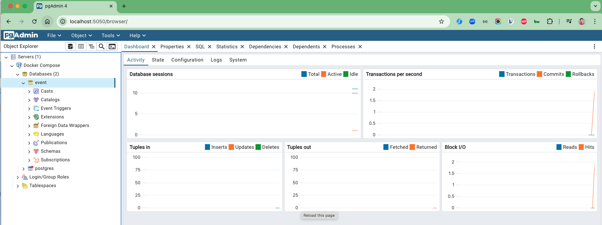

# spring-boot-pgadmin

### Things todo list

1. Clone this repository: `git clone https://github.com/hendisantika/spring-boot-pgadmin.git`
2. Navigate to the folder: `cd spring-boot-pgadmin`
3. Run the application: `mvn clean spring-boot:run`
4. Open your favorite browser: http://localhost:5050
5. Accessing PostgreSQL Database
6. We now want to verify that our function ran as expected by checking the database for the new entry. For that, we use
   docker exec -it.

```shell
docker exec -it my_postgres_container psql -U my_user -d my_database
```

7. Exploring Data with PG Admin
   You'll find more on PG Admin at https://www.pgadmin.org/, offering a feature-rich administration and development tool
   for PostgreSQL. It allows you to comfortably view tables, index, and data within your database.

To incorporate PG Admin into your Docker Compose module, add the following code to your docker-compose.yml:

Now, upon running the application and visiting localhost:5050, you'll be welcomed with the login screen for PG Admin. On
successful login, hit Add New Server, and use your docker inspect command to fetch the container's IP address, or set
the container's name as the hostname/post.

```shell
docker ps
docker inspect 7738686e136d | grep IPAddress
```

However, there's a minor flaw. Every time the application is restarted, you'll have to log back into PG Admin. To avoid
this, explore the Github repository published by my coworker, Adib Saikali. The repository includes a servers.json file
with login details for PG Admin, and a docker-compose.yml with volumes for PostgreSQL and PG Admin.

```json
{
  "Servers": {
    "1": {
      "Name": "Docker Compose",
      "Group": "Servers",
      "Port": 5432,
      "Username": "hendisantika",
      "Password": "53cret",
      "Host": "postgres",
      "SSLMode": "prefer",
      "MaintenanceDB": "event",
      "PassFile": "/tmp/pgpassfile"
    }
  }
}
```

Now each time you restart the application you will be automatically logged into pgAdmin.

### PGAdmin UI



